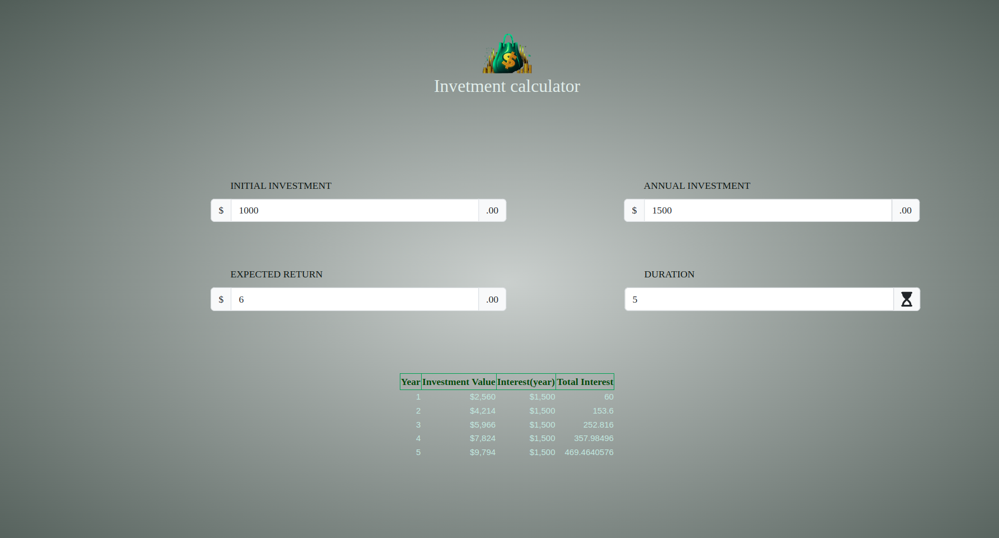

# React Web Development

### Installating required packages 

```shell
 npm i --save @fortawesome/fontawesome-svg-core
npm install --save @fortawesome/free-solid-svg-icons
npm install --save @fortawesome/react-fontawesome
yarn add @fortawesome/fontawesome-svg-core
```

## Demo
Demo can be seen as image format:
<p align="center">


</p>
